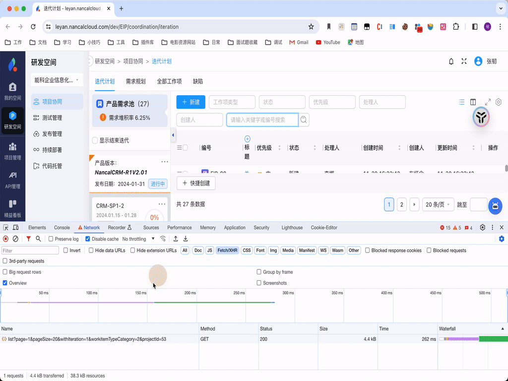

# utools-Jarvis

## 使用说明

utools 开发工具

## 功能

### CURL to Function

说明：

- 将 一段 cURL 转换为带类型的前端接口函数

使用方法：

- 复制一段 `CURL`,
- 打开 utools 自动匹配 cURL2Func 工具
- 回车直接复制到当前鼠标激活位置（当前系统剪贴板中也有）

效果如下：

- 

## 打包

先在主目录下执行`pnpm build`进行打包，打包后的资源在`src-utools/dist`中，打包`src-utools`目录即可。
